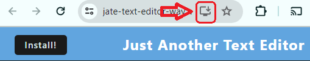
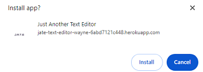
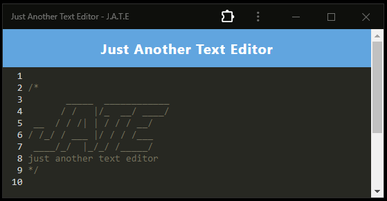
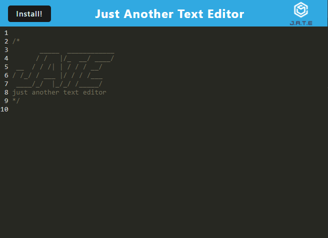
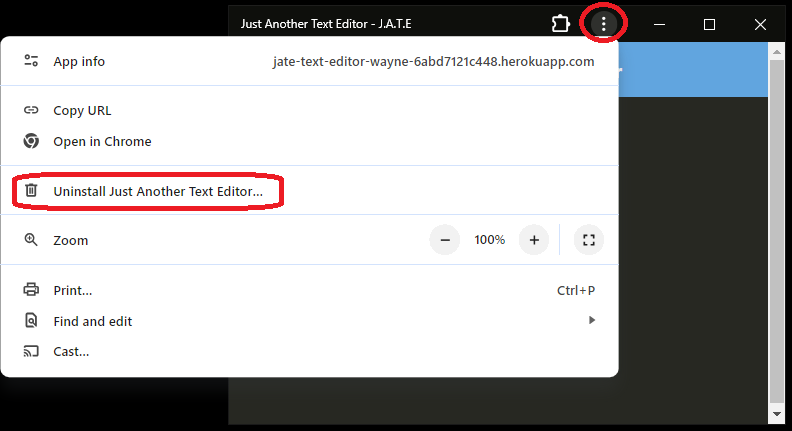

# <Your-Project-Title>PWA-Text-Editor

## Description 

- What was your motivation?

        To take notes/codes without internet connection

- What problem does it solve?

        Developers now have a place to store their notes/codes without internet connection restriction

- What did you learn?

        PWA configs, IndexedDB API

## Table of Contents

- [Installation](#installation)
- [Usage](#usage)
- [Uninstall](#uninstall)
- [Credits](#credits)
- [License](#license-and-badges)
- [Additional Info](#additional-infomation)

## Installation

Checkout the Link !!

https://jate-text-editor-wayne-6abd7121c448.herokuapp.com/

You can use it online or

Click the install button  or

Use this icon appear on the right of thr Url address bar

to install the APP to your local device.

It will ask you if you would like to install

The app will pop out

And a small icon will be on your desktop.

## Usage

You will see this page after you open the [link](https://jate-text-editor-wayne-6abd7121c448.herokuapp.com/) above.

You can either start editing text on this page, and the data will be save to your broswer

or

You can use it on local machine(without internet connection), and the data will be saved in the local App.

## Uninstall

Click the three dots, and click Uninstall Just Another Text Editor

## Credits

Class REPO examples, and Wayne

## License-and-Badges

---

## Features

A simple Text Editor where you can snippet some codes with Javascript color style theme on local devices.

## Tests

none

## Additional-Infomation

Github: https://github.com/wayne80361

Email: wayne80361@gmail.com

REPO LINK: https://github.com/wayne80361/PWA-Text-Editor-Wayne

Heroku Link: https://jate-text-editor-wayne-6abd7121c448.herokuapp.com/
